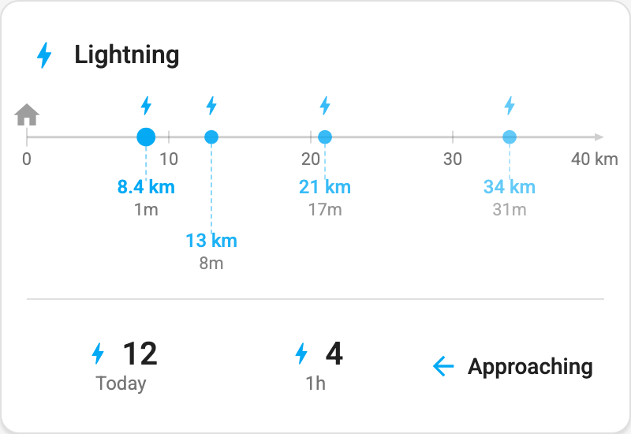

# Lightning Proximity Card

A Home Assistant Lovelace card for lightning detectors such as the Ecowitt WH57. Visualises strike distance on a one-dimensional axis from home, with activity summaries and trend detection.



## Features

- Horizontal distance axis (home at left, max range at right)
- Strike markers with age-based fading
- Label de-cluttering with collision lanes and pixel clustering
- Today count, last-hour count, and Approaching/Receding/Variable trend
- Historical strike reconstruction from Recorder data
- Live strike updates with debounced distance correlation
- Light/dark theme support via Home Assistant CSS variables
- Responsive layout (320px–wide)

## Installation

1. Build the card:

```bash
npm install
npm run build
```

2. Copy `dist/lightning-proximity-card.js` to your Home Assistant `www` folder.

3. Add the resource in Lovelace:

```yaml
resources:
  - url: /local/lightning-proximity-card.js
    type: module
```

4. Add the card to a dashboard:

```yaml
type: custom:lightning-proximity-card
distance_entity: sensor.ecowitt_lightning_distance
count_entity: sensor.ecowitt_lightning_count
```

## Development

Run the standalone development harness (no Home Assistant required):

```bash
npm install
npm run dev
```

Open http://localhost:3000 to interact with fixture data. Use **Fire strike** or **Auto-fire** to simulate live detector updates. Use query parameters:

- `?fixture=sparse` — preferred mockup layout
- `?fixture=live` — baseline history for live strike simulation
- `?fixture=dense` — dense strike activity
- `?fixture=repeated` — clustered identical distances
- `?theme=dark` — dark theme preview
- `?width=400` — card width in pixels
- `?gallery=1` — all fixtures at multiple widths

Run unit tests:

```bash
npm test
```

Build production bundle:

```bash
npm run build
```

## Configuration

| Option | Default | Description |
|--------|---------|-------------|
| `distance_entity` | *required* | Lightning distance sensor |
| `count_entity` | *required* | Lightning count sensor |
| `title` | `Lightning` | Card header title |
| `max_distance` | `40` (km) / `25` (mi) | Axis maximum distance |
| `tick_interval` | `10` (km) / `5` (mi) | Axis tick spacing |
| `display_minutes` | `60` | Strike display window |
| `max_rendered_events` | `40` | Max markers on axis |
| `max_labels` | `8` | Max labelled markers |
| `trend.enabled` | `true` | Show trend indicator |
| `trend.sample_size` | `4` | Observations for trend |
| `trend.window_minutes` | `60` | Trend time window |
| `trend.minimum_net_change` | `5` km / `3` mi | Min change for trend |
| `animation` | `true` | Pulse on new live strike |

## License

MIT
